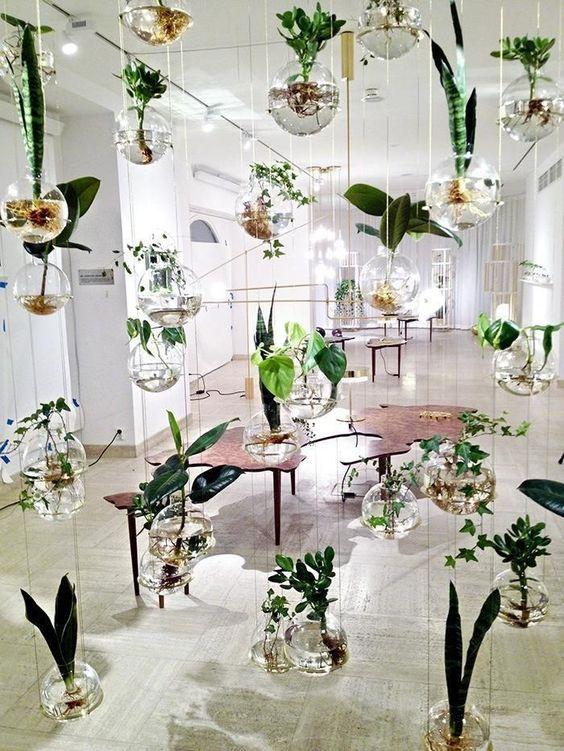
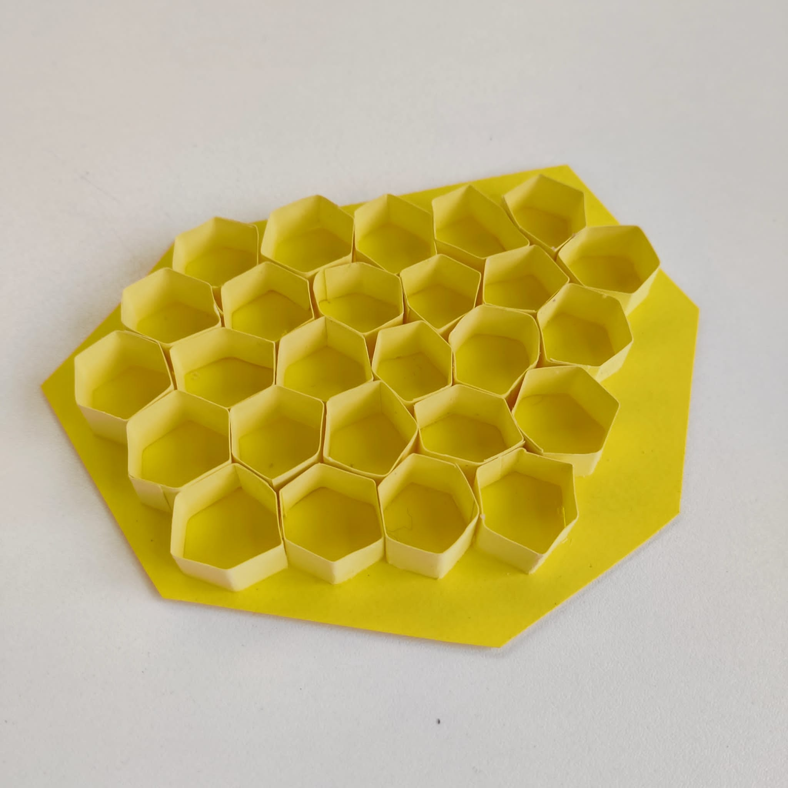

## chat with Camille

- choose the scene (imaginative/ecological/...)
- iceberg, archive, future
- gesture, zoom in/out, ant
- pitch:...
- different gardens

## Context

### conversation

Take the example of the iceberg that's gonna be melted in the future, (snapshot) find a central actor (bees?) and a cycle to create our narration :
for instance if we take the bees exemple -> if there is no bees, there is no trees, no flowers, no animals, and ultimatelz no humans.

Let's make a design fiction!

Now Huiwen asked : then there's nothing ? only stones. Everything is dead. To what Elie answered : well we don't need to go that far on the timeline (oblivious death) we can go somewhere in the middle. Then Wen said : ah! so we can see the past and future at the same time.

So now we need to find this actor.. is it the bees ? or something else. Also we need to start building smth so yeah that was our morning until now (11.06).

(after lunch)

## Inspirations

- Floating Worlds
- Ukiyo-e (pictures of the floating world)
- Shan shui (mountain-water paintings)
- Chinese garden
- Hanging garden of babylon
- Air/Water/Qi (mist)
- lots of pictures

## Moodboard

https://pin.it/1dXnFQD

## Ideas

### Ecosystem of missing things/"floating" things

- garden with no plants and trees
- beehives with no bees
- trays of fungi
- flowers no pollen
- cows with no life?
- Folding Screens?

### Immersive/floating environment

- in the "garden" of missing things
- background/distance: shadows of waht's in the past
- surroundings: mist and the temporary objects

## Maquette

- Containter: a box with the silhouettes of missing things (bees, leaves...)
- Objects Inside: hanging the space, surrounded by mists
  jars, beehive, branches...

(Concrete exemple : one of the abstract silhouetted could be one of a bee on the exterior part (the missing thing) and on the inside its counterpart : the beehive or honey comb.)

A little timeline...

So, first we strated doing sketches of structures we wanted :

We were looking at images on pinterest for reference simultaniously and made a selection we will share here.

Ultimately we want the silhouettes on our box to be holes/spaces into our structure that will allow us to see inside, a bit like the image below :

For the inside (the garden) we found several images that interested us, mainly because of their caracteristics like disposition in the space (hanging, superposed, etc.) but also because of their individual nature (in glass,boxes,containers) but still part as a whole as well :

With those references and sketches we started building our maquette with an old cardboard box. Wen did the silhouettes on Photoshop, printed them and glued them on the box :

I did the honey comb with carboard paper :

I plan to get my hands on some branches, attach them to create a small tree without leaves. We still need to find other elements that will constitue our garden.
