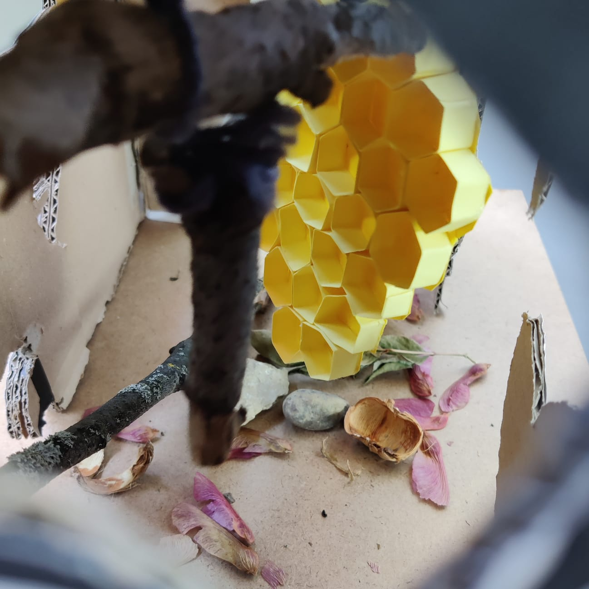
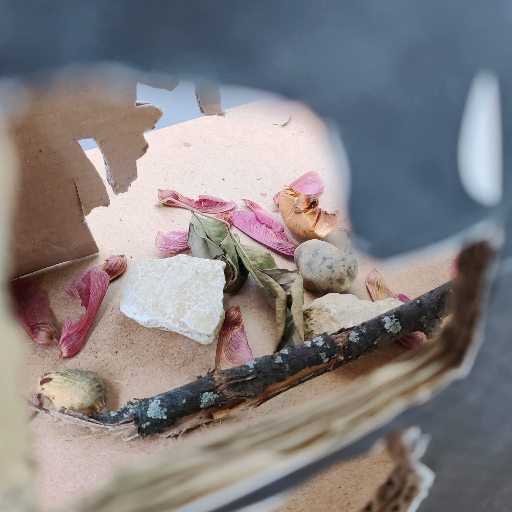

## feedback by Camille

We need to do a clean version of our scketches - those from tuesday were brainstorming and aren't that clear.
Ou maquette evolved (pictures below) - Our intention might be clearer now.

## feedback by Douglas

"Still a work to do but I see where you are going."
Also gave the idea to scan one hexagon from the bee comb so we can have something uniform that we can use as a prefab on unity.

## Maquette

So, the box we had yesterday evolved "more" into ou image reference for the outside (check devlog 09). We also worked on the inside part of the withered (flétri) garden.

We need to update the pitch !
