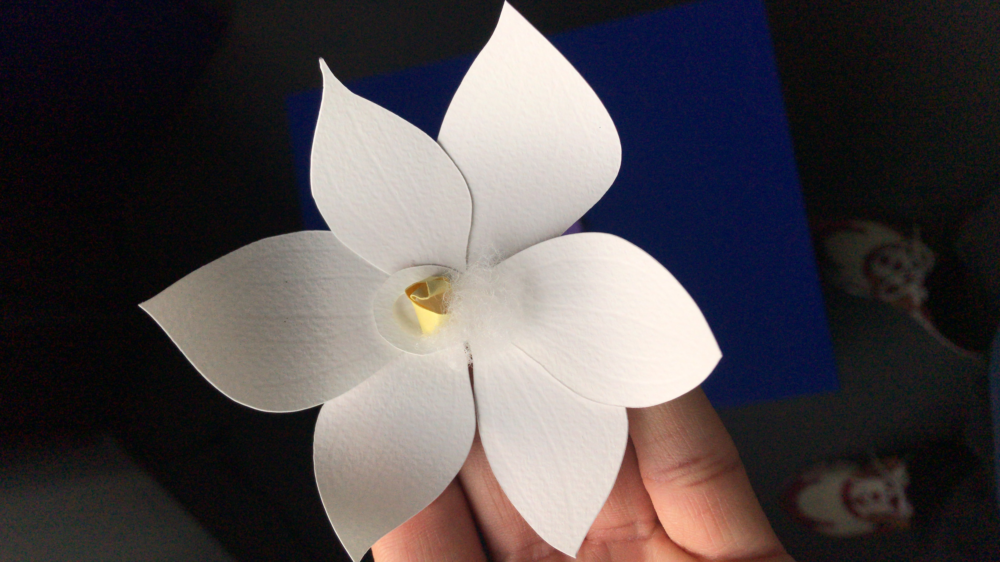
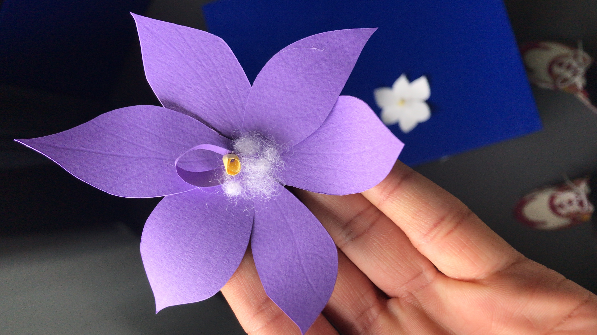
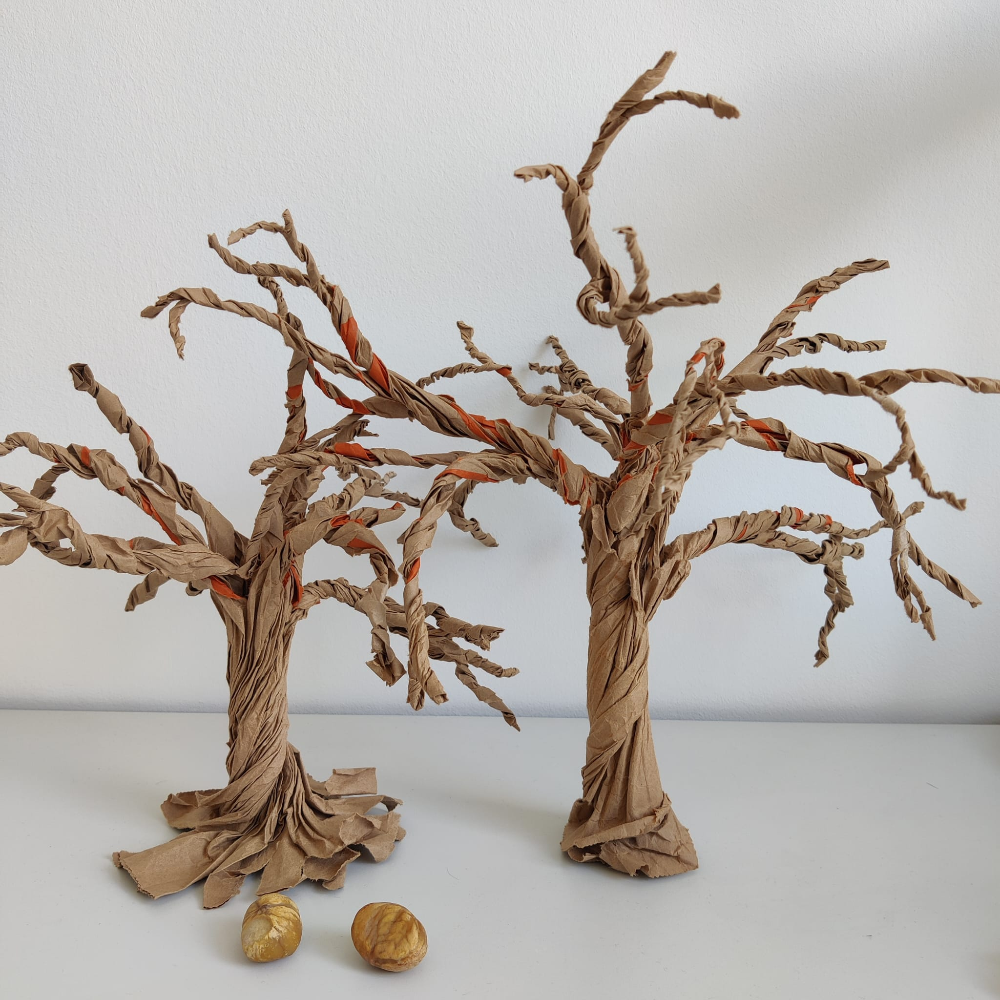
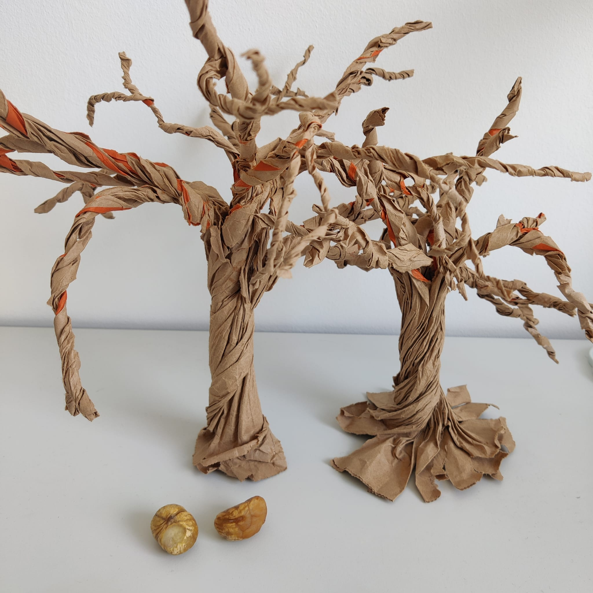

## Weekend

So, on thursday Wen and myself talked about the project. It was great because thanks to Douglas and Pierre's advise we knew what we had to do to complete the next step which was to start building our garden. Prior to those comments we had made a selection of endangered plants on a miro board so at the end of the day Wen and I chose which vegeatation each of us would do and we left on this.

During the weekend we worked each on our side, I came to Geneva on saturday to buy some paper a special paper I couldn't find in Neuchâtel for the life of me.

I did some star-sun orchids a I then sent to Wen and she did the american chestnut wooden-like base she sent me (pictures below).

