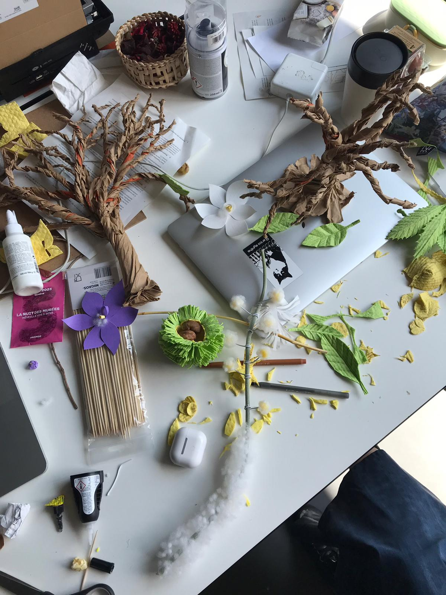

## Morning

In the morning we showed each other the rest of the stuff we made on the weekend. I tryied to do paper prototypes of the black cohosh and the pairie white fringed orchid which ended up looking awful. On the other side Wen showed me other parts of the tree she did, like the leafs and the nut shell and it looked super nice, everyone loved it.

We discussed about the other elements of the garden we still needed to do and ended up going to Migros to buy some materials. After gathering what we needed I went back to the black cohosh with my new materials and Wen started doing the white prairie orchid.

## Camille's Feedback

Camille gave us some feedback at the beginning of the morning and asked us to think about our scene and its composition. She said that if we had two gardens for the presentation, one could be in negative (colors?) to be able to differeciate it more with contrast. She also gave us feedback about the the elements that were done, she liked the chestnut and its different spongy parts. For the leaves of the paper orchid she said it could be cut with laser and graved with motifs on the leafs.

## Afternoon

In the afternoon, I continued with the cohosh (picture below) and Wen continued with the white prairie orchid. We discussed the goal of this game while doing working on our plants and flowers. We also wondered if we HAD to be a gardener or a bee like we said before (we liked the bee idea more) but last week we were a bit discouraged about this idea after talking with Douglas and Pierre because flying in Unity is hard to do. We ended up resuming the experience to :

"You are a gardener and the vegetation composing your garden is dead. To restore it you need to plant the dying elements with your magical hands and find the right place (puzzle) so when you do, this dead element will transform itself into the beautiful plant, tree or flower it was before. Slowly, plant after plant, flower, after flower, the bees would come back, repollinate the place thank's to the nectar they collect and honey would come back again."

That's we said to Sabrina when she came to talk with us.

See below pictures of the WIP :

## Sabrina's Feedback

After hearing the "pitch", Sabrina asked right away : "Why are you a gardener and not a bee ?". We explained that we were told it's hard to fly in VR and she answered it wouldn't be a problem.

So it was decided, we will be a thelepatic gardener bee. The last bee standing in a devastated world. The goal is to reconstruct the once lush and beautiful vegetation of what was called home. With the help of its antennas (first-person mode), the bee would carry the dead elements into another soil, a fertile one. Plant after plant, flower after flower, tree after tree, the environment is slowly rebuilt and bees are coming back to the hive. Sabrina also asked about the water, where would it come from ? She already knew where it could come from but she wanted us to guess. Which we did. It could come from the tears of the bee (of sadness at first and maybe of joy later).

We asked about the mechanics we previously thought (puzzle game) and she told us it doesn't have to be a game where it's hard to perform. It could be enjoyed only with the action of re creating a beautiful garden piece by piece. That, as I understood, it would be more poetic that way.
