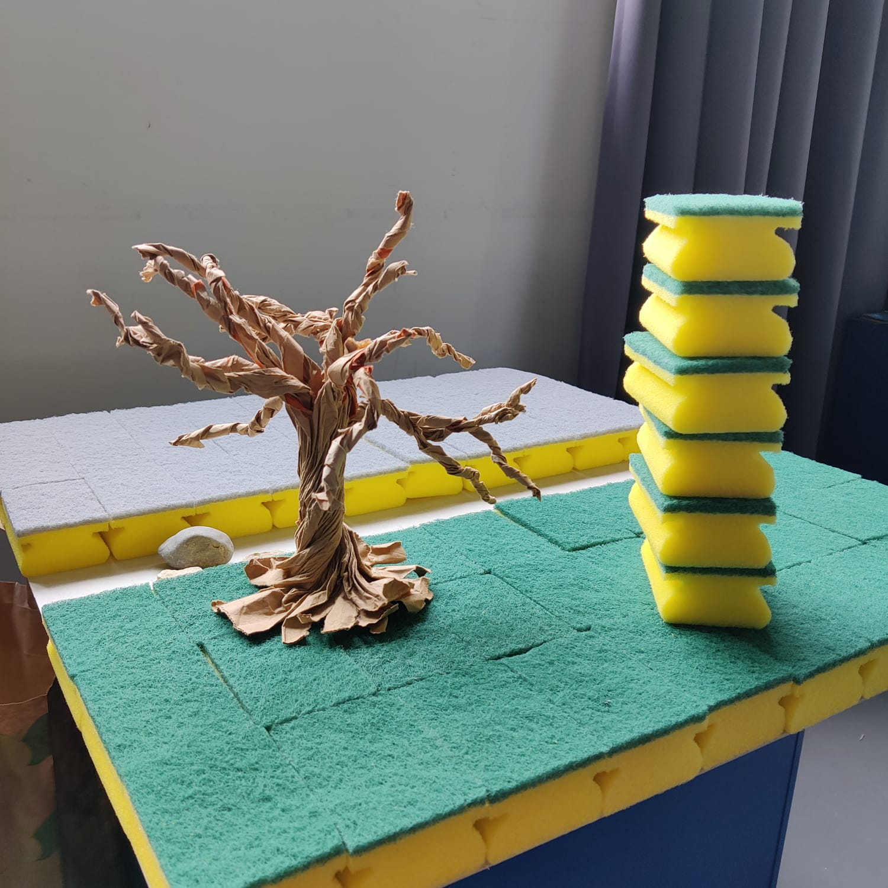
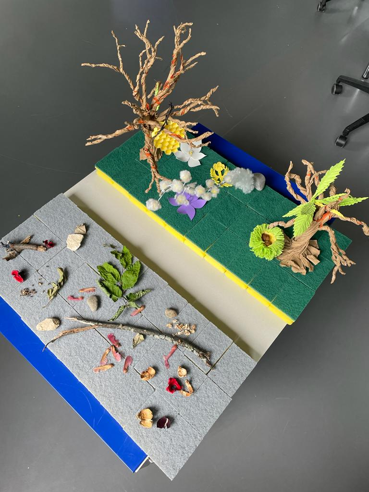
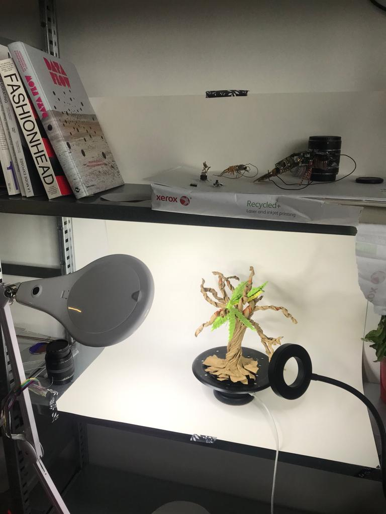
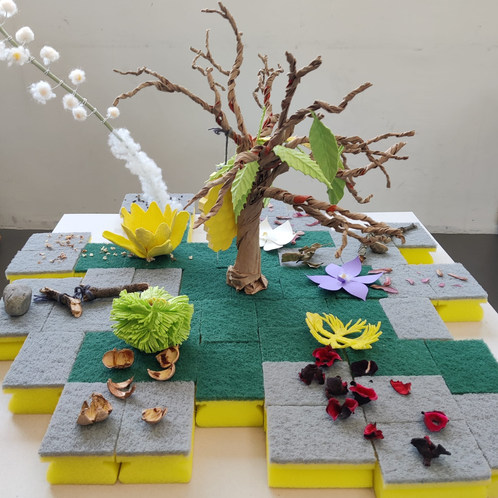
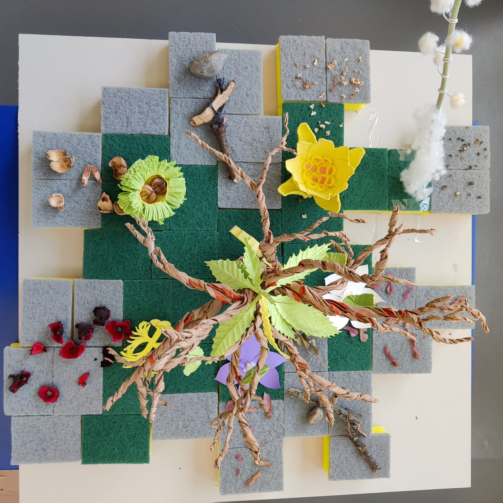

## Morning

In the morning we started thinking about the scene. First we were wondering about the base. After looking t what was aroud us, we chose one of those gray carboard squares we used for rendus. Then we wondered "how are we gonna fix things?". We had a pac of sponges form yesterday. We remembered there was green and and grey. We could use the grey for the dead garden and the green for the living one. Thus, We went and bought something like 50 pieces (we will distribute them at the end of the workshop, no waste here).

We started assembling the maquette and we separated living garden from dead garden as you can see on the picture below :

## Afternoon

In the afternoon, while Wen was finishing one of the orchids, I started scanning some elements of the maquette (one tree and the nut shell). I used a pre-constructed setup Margot and Dorian built in the lab next door. I also used the Syrp and Iphone Douglas put at our disposition. It went pretty well, the white on the background rebounded a bit on the scans but it should be easily earsable on PS or Substance. We will try to scan with a black background (apparently it's better) on Thursday because tomorrow the spot will be crowded.

Then we had a talk with Sabrina that was mainly about the composition of our scene and how to correctly build it. The main word was probably to BLEND the dead garden and the living one to make one organic scene. Also she told us that maybe the main tree (the one that has the bee hive) could maybe be placed in the middle. So we did and we started building around it. It took us some minutes but we started to find a pattern that was interesting for the core idea of the project which is to go from dead to alive.

So every "edge" of the maquette starts with the grey floor and dead elements of the dead garded. Those dead elements act like a tray and connect to the green garden pieces which have the living elements of the garden. It symbolises the passage from dead to living.

So a word about the experience of the player :

So as we said before, you are a bee. At the beginning there is no green floor any where. There is only desolation and death. Only gray floors. The tree in the middle of the maquette has no leafs and the bee hive attached to it is all dried up and moldy or whatever.

The bee couldn't be sadder. It's the last one of this garden but it wants to make it alive again. To do that, it picks dead elements, like the dry remains of an orchid for exemple, and it burries them/plants them in the soil. Thanks to the water coming from its tears of nostalgia, the orchid comes back to life.

Everytime some vegetation comes back to life, the tree in the middle is affected positively and starts to recover : leafs start to grow again and the hive slowly is restored as well. Talking about the hive, bees would start appearing again and even maybe come together as a group of "gardener" to replant all the dead elements to slowly grow the lush garden that once existed there.
