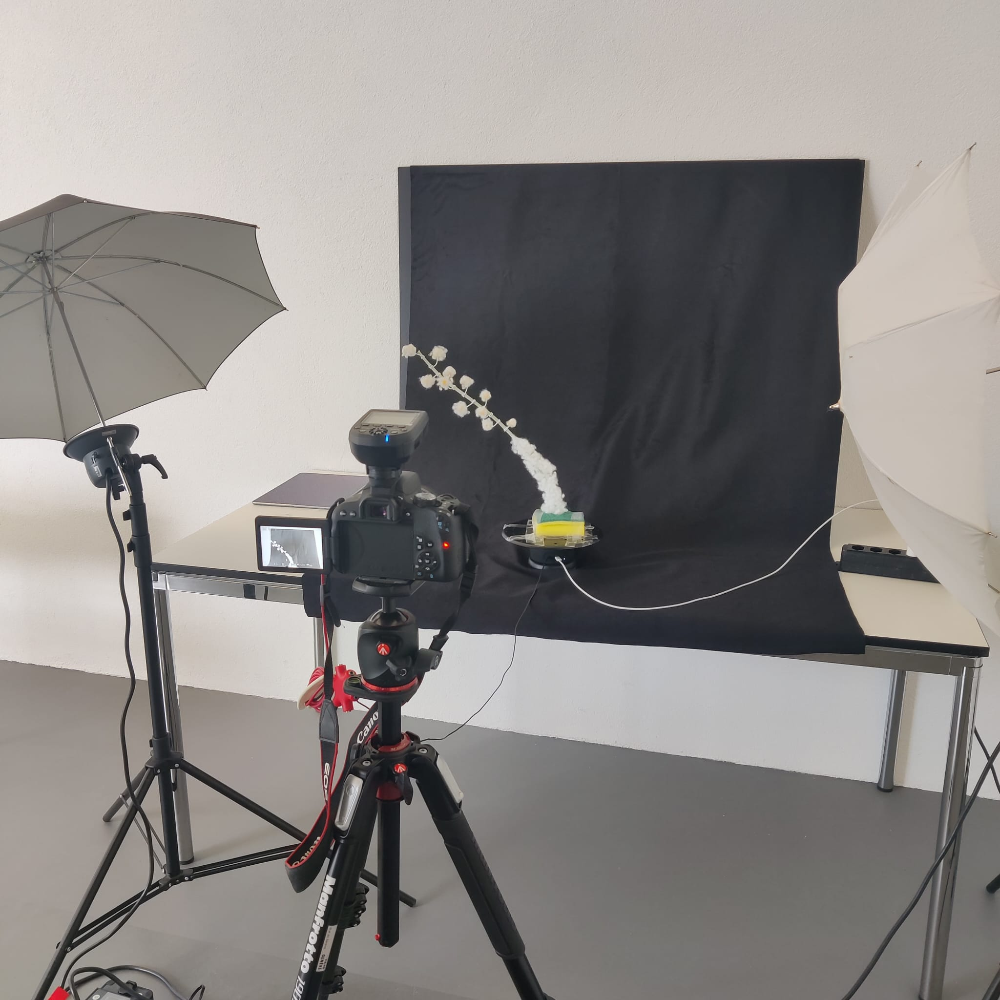

## Weekend + Monday

During the weekend Wen and Myself planned to scan our stuff on friday. I couldn't make it to Geneva because of poor organization. Wen did all the scans and most of them looked pretty well (see below).

We redid the cohosh with another setup to see if it would look different (camera instead of polycam).

It did look better with polycam tho (less cleaning needed).

