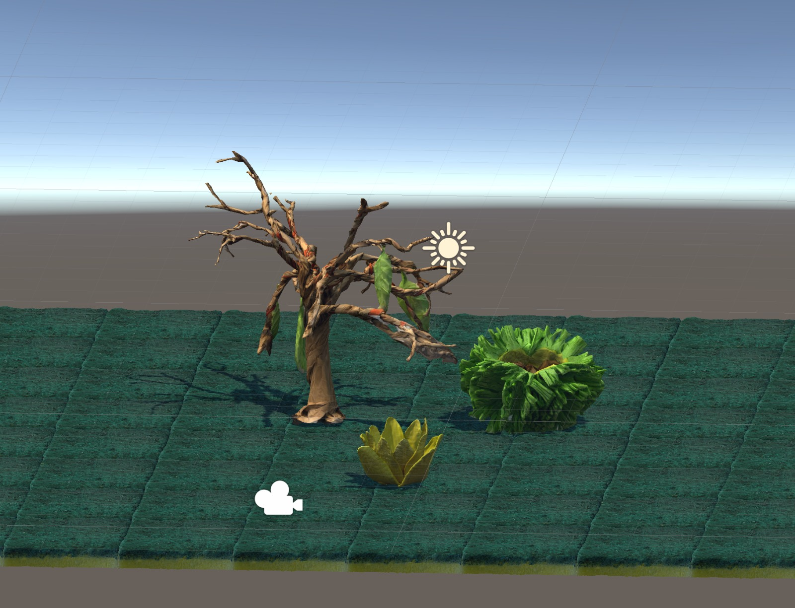
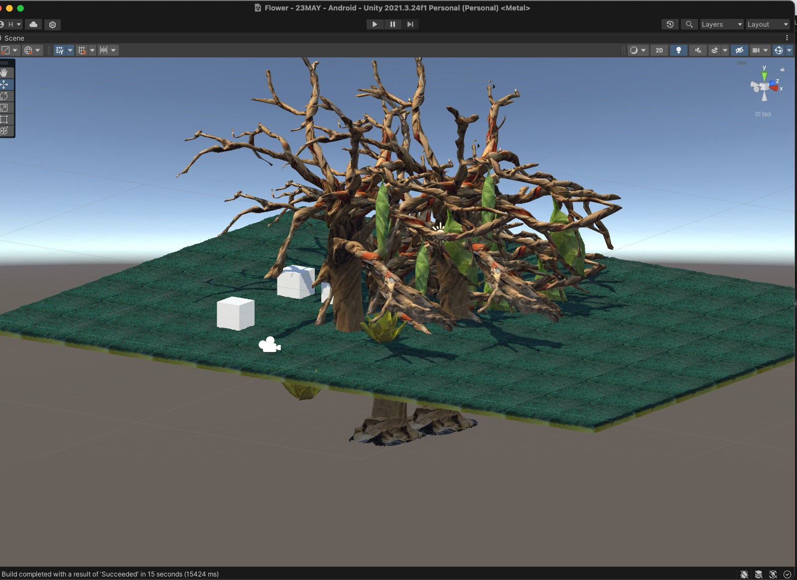
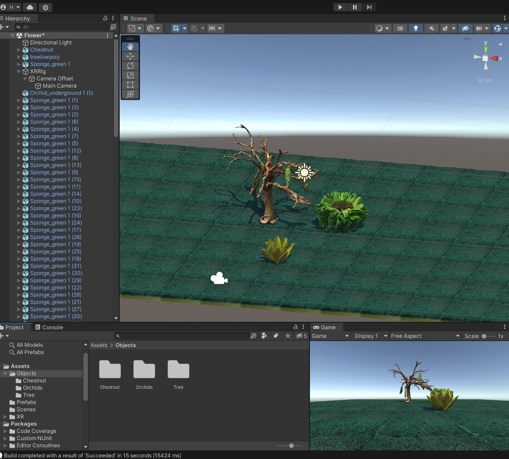

## Import objects to Unity

Today we cleaned a few objects (big tree, chestnut, underground orchid, green sponge) and imported them in Unity. We tried to apply the materials on them and it worked. We built a first draft of our world, and tested it in the Oculus Headset.

