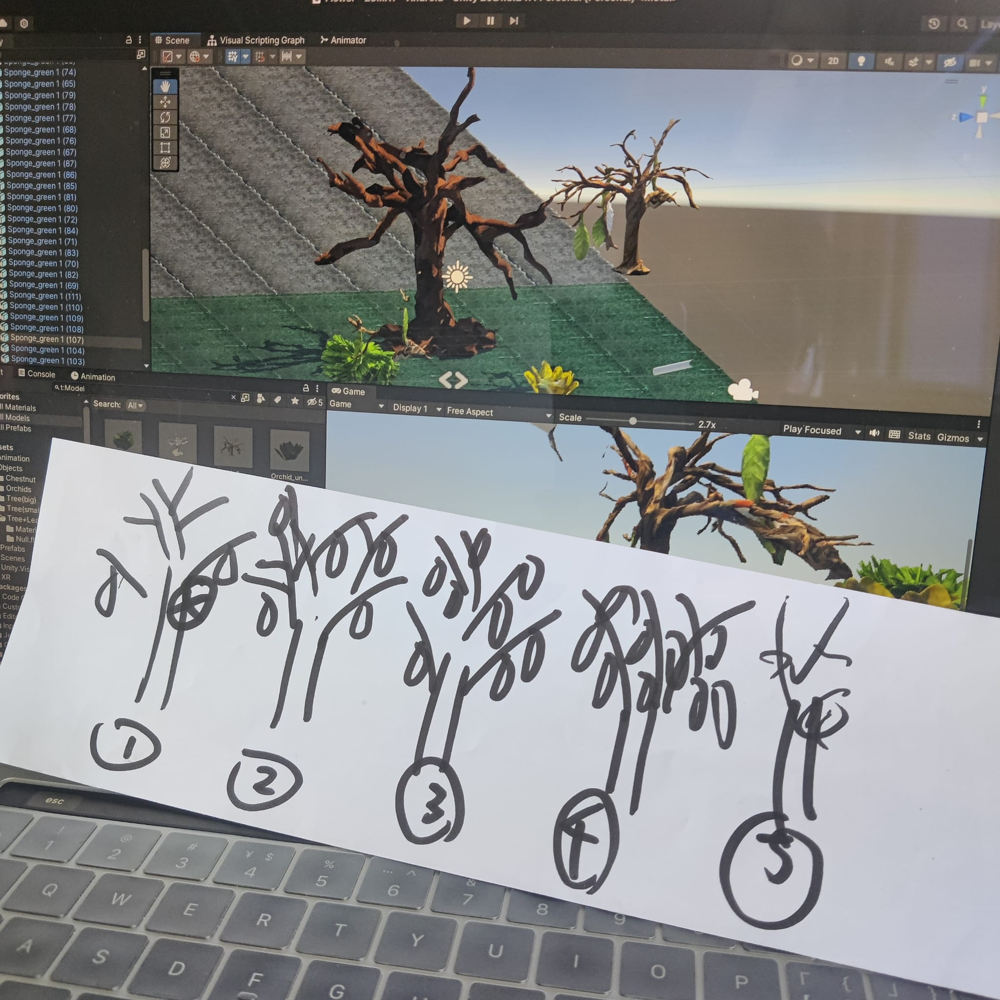
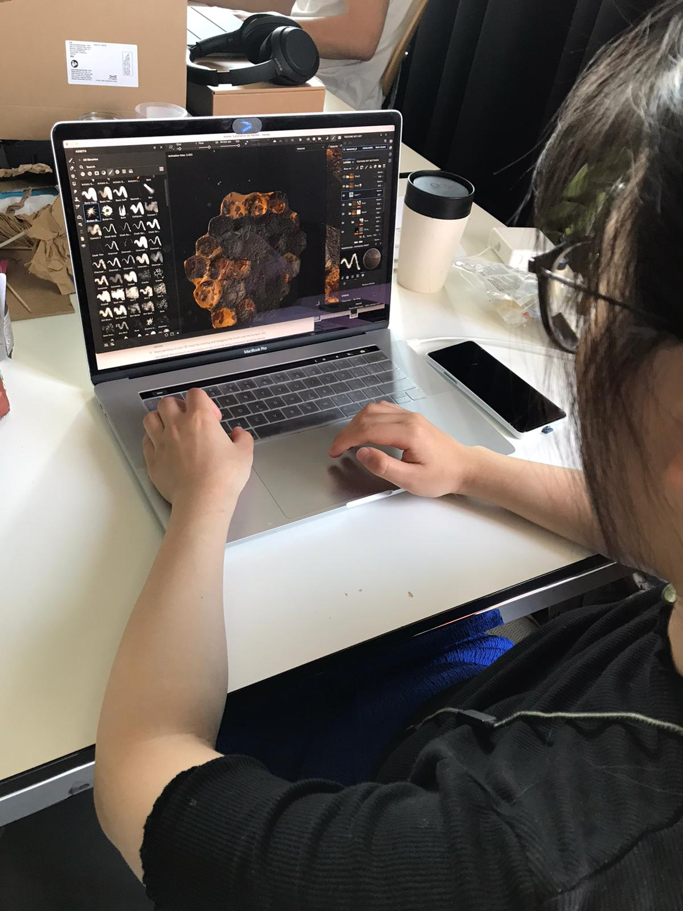
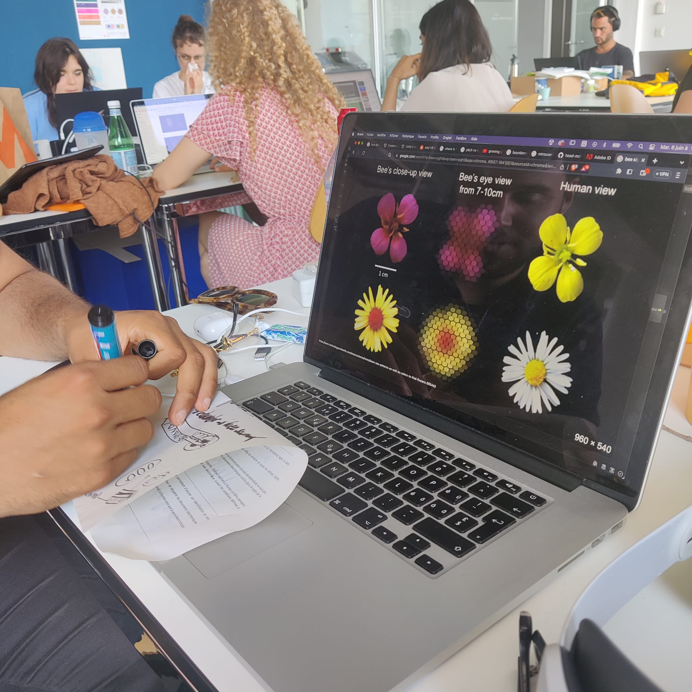
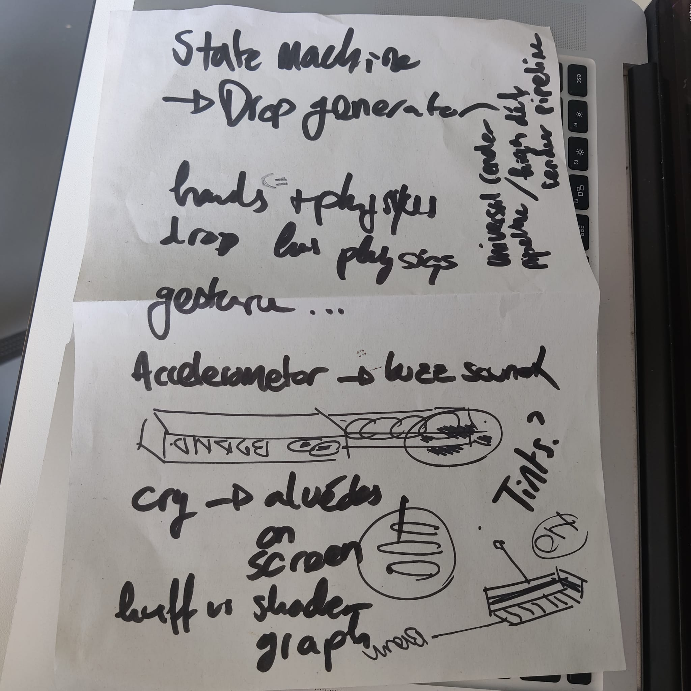

## Ideas about state changes
- For Tree & Leaves & Honeycomb: 
  - idea 1. models dont change, only change textures in 5 states 
  - idea 2. change models, with more leaves and differenr textures in 5 steps
- For other small objects:
  - change only once
  

## Painting
Huiwen was painting the honeycombs with 5 steps of textures, from Decadence to Vitality.

## Tutotial
Elie was doing the tutorial of Clive the Cat, learning script machines.

## RDV with Douglas and Camille
We talked about the project.md and got some feedback, generally positive, still there were some questions.
- Antennas: Douglas suggested springs on jointed object
- Gesture: Douglas suggested to use "physics" on hand to play with the waterdrop
- Landscape: Camille suggested to create abstract shapes
- Color: Camille requeted to use 4 colors with different grading to create coherence
...

