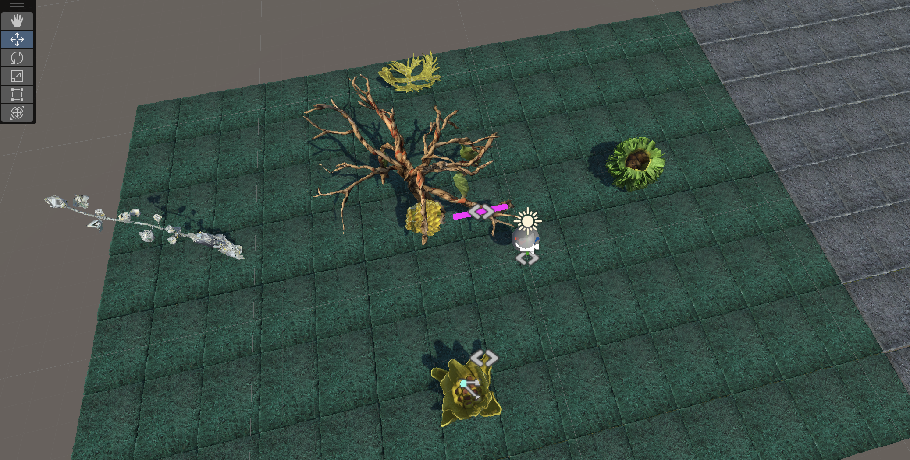
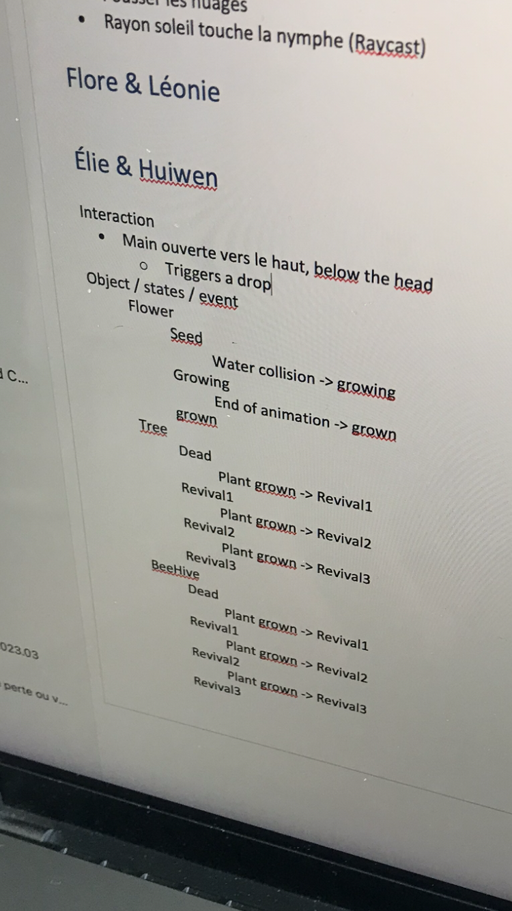

## Q&A with Pierre

- We had a problem with Build and Run the game on Oculus. It turnd out to be an error with the naming of project.

  - Solution: Project Setting - Player - Change the Company & Product Name - Deselect "Override Default Pakage Name"

- We added a script machine on "teardrop" in "Graph" mode, in which we couldn't get local asserts.
  - Solution1: Use "Embed" mode with the same full script
  - Solution2: Use "Embed" mode on the teardrop, and create another "reusable" Graph script as a Subgraph

## Project plan

- We created a TODO list.
- Wed & Thu, We plan to do more about script machines, animation, headset test, and we'll create more asserts.
- And we'll do the paintings and the polish of models in this weekend.

## in the Scene

- We did a first draft of the scene, with 4 small plants around a big honey tree.
- The scene is a bit empty at the moment.
- We don't have objects in decadence state yet, we will either scan more (which will be difficult to clean) or create models in C4D (probably a better option).

## XR hand demo test

We were following the XR hand demo tutorial to install the XR toolkits in a new 3D URP project. A lot of errors happened. We had to try it on both computers bcs of unexpected problems with bugs and cables. Eventually it worked on Huiwen's mac and we could drag cubes in the scene.

## Notes from Elie took from the interview with Pierre

"Honey tree

Animate the colors play with the inspector
See how I can change things -> visual scripting
Play with alpha (trans), saturation, brightness.

We can change texture based on times on on events (step1..step2..step3).it can be a percentage to. Every 20% it increases.
State machine -> animator or in visual scripting.
If you have an animation on the honey comb you can trigger.
Play with the animator, based on triggers and steps -> visual strict - step value - external

From the visual script from the flower set condition to the animator of the honey comb.

Intermediate animation. -> plants
Plant can grow with an animation on the scale
Scale 0 to 1 and seed does from 1 to 0.
Start easy and increase complexity

- Gestures

Tilt the head (pencher) - whenever you put the hand turned to the top there’s water dripping. Different conditions - the vector of the inside of the hand has to be up and has to be below the head- should have the same z and x values from the world. As long as you are at the same vertical position (add a tolerance because you can’t be too precise).

Hands up - horizontal distance is less than 20 cm. Since you need to see the hand you tilt the head and see the drop.

Drop can be a blue sphere. Or a drop model.

Not sure hand mesh has a collider - if you want to collect water. Challenge to have the hands (you want to see them and have a collider to collect the drops ). Maybe just add the hand collider to the hand but not sure. If the drop has a rigid body it cannot fall because its held by the hand and the it falls once you move your hand.

Add mesh collider - examines the mesh of the hand

Maybe wee can fake it - drop has physics with a sphere collider. And the hand can have a box collider which is flat. When the drop contacts the hand it,

Drop is a child of the hand - when you detect hand turns you but the physics again.

Antennas -
Head is the camera anything you attach to the camera will move if you make it child of the camera. To be shaggy moving- first part you don’t see will be fixed at the camera and then use a joints- spring joints- and make limits so each part of the camera can have a bit of movement.

Sound- every time you move
Need to check if it’s below a certain value and consider this value to be the zero. Movement is a change in position (a speed basically). Detect the movement you need to detect the change in position.

DROP SPAWNER AT THE POSITION OF THE CAMERA
Open the rig

Add an empty game object"

Also wwe took a picture of what the different states we discussed with Pierre :

