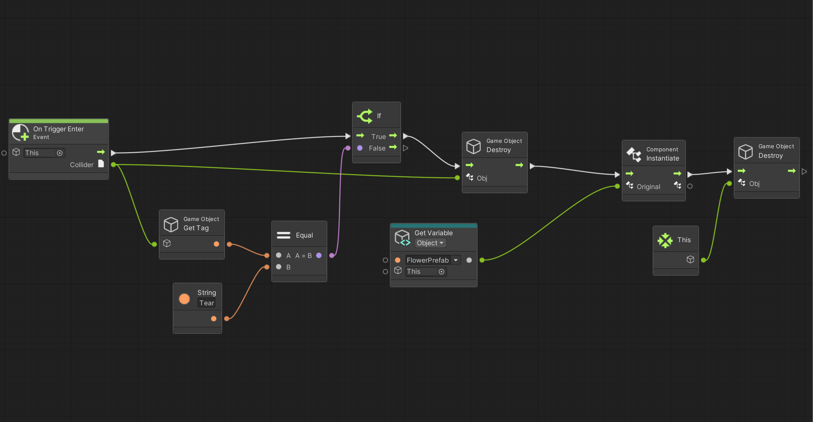

## Note on Pierre's tutorial of sharing project with Github

- Be sure to use .gitignore

  - blog.prossel.info/212-gitignore-pour-unity
    - Download & Unzip
    - to show hidden files on MAC: CMD+Shift+.

- Commit to Github

  - create a repository
  - check the files adn be sure not commit library

- Terminal

  - cd (root of the project folder) ENTER
  - git int ENTER
  - see ".git" in project folder

- Collaborate
  - clone a repository
  - work on different scenes?
  - check the changes each time you commit

## First Scene

Huiwen did a first draft of scene in the new 3D URP project, with XR hand tools. Then we both worked on the position of the tears (spheres), working with empty game objects from where the spheres would spawn. Everything worked pretty good. The only problem being the rate frequency of the spawning, we haven't yet found the node we need to be able to control the pace or the rate.

# Animation

Elie started to look into the anomation to be able to transform our plants. After trying out with chatGPT and spending a few hours trying out stuff, He gave a try to ray casting which ended up working out. The only issue was the logic of its usefulness. After talking with Luka of the issue both started a new scene with a new logic of animation based on prefabs, tags, conditions and replacements. It worked well and tomorrow we will try to apply the graph to our scene.

