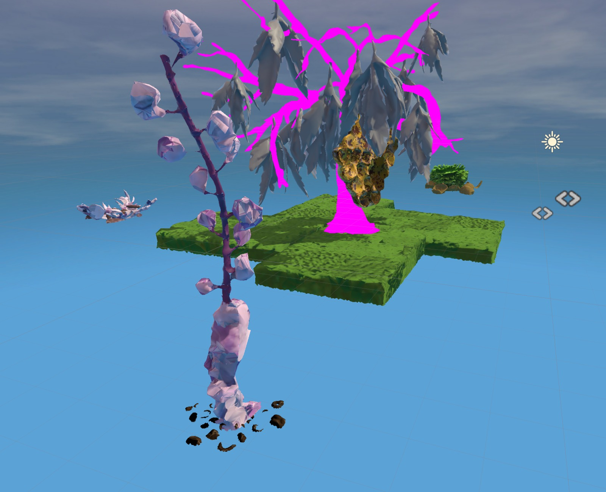
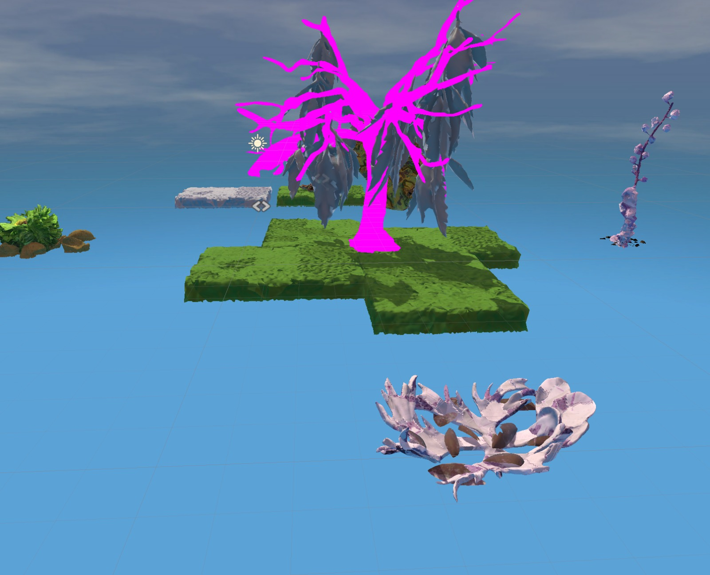
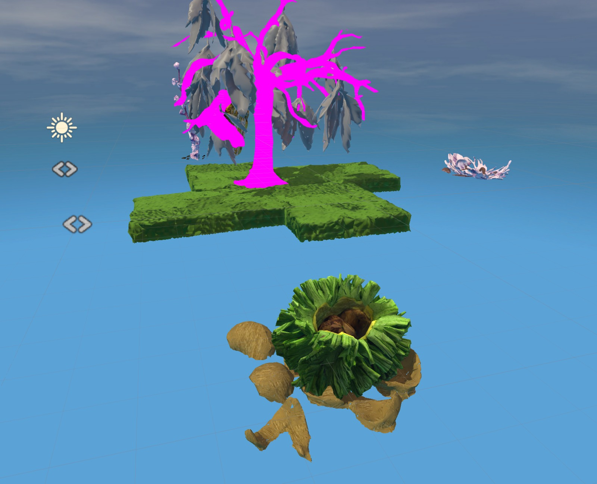
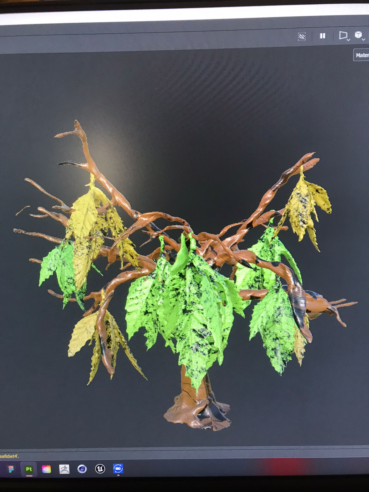

## Friday, 9.June
### Animation
We tried out the animation of morphing on the underground orchid. It took us a lot of efforts to correct all the small mistakes, but eventually it worked well, just needed to add some effects to get the transformation more natural.

## Sunday
### Assrts
Huiwen created a color palette with 4 main colors and 2 additional supporting colors.

Huiwen cleaned the nutshell scan and painted it, fixed the big tree and combined the leaves, painted one dry flower, figured another dry flower model...

## Monday
It is difficult to create proper materials from Substance to Unity, but anyway today they are fixed. Due to the limit of time and Oculus' performace, they are not perfect. The models and painting of seed, dry flower 1,2, black cohosh, two colors of sponges, the 5 different stages of big tree and leaves are updated in the scene. And we have a new sky now. Colors of the tree and leaves are not applied yet.

