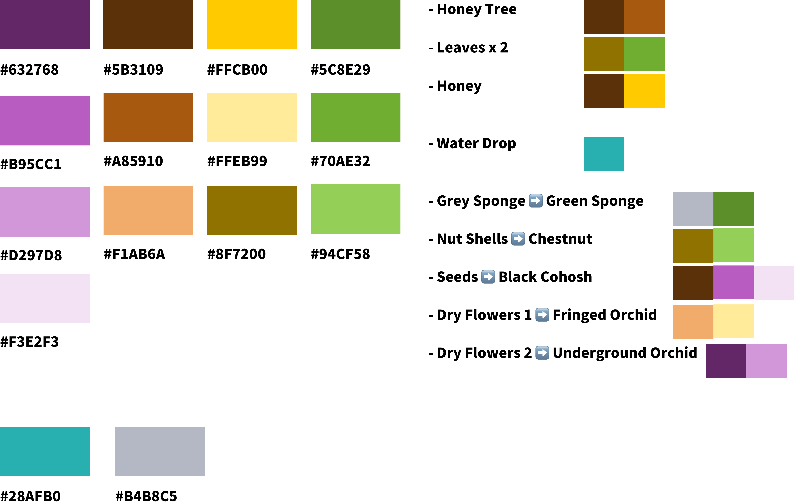

## Friday, 9.June

### Animation

We tried out the animation of morphing on the underground orchid. It took us a lot of efforts to correct all the small mistakes, but eventually it worked well, just needed to add some effects to get the transformation more natural.

## Saturday

### Animation

Elie continued working on the smoothing of the animation. He added a particle system which would then be used as smoke, once parameters were set and materials were created for it.

## Sunday

### Assrts

Huiwen created a color palette with 4 main colors and 2 additional supporting colors.

Huiwen cleaned the nutshell scan and painted it, fixed the big tree and combined the leaves, painted one dry flower, figured another dry flower model...

### Animation

Now that the base of the script was working, for the transformation part and that smoke was added to smooth the effect of transition, Elie focused on changing the the plane color when the animation started, which was a parralel to the sponge changing in our scene.

## Monday

It is difficult to create proper materials from Substance to Unity, but anyway today they are fixed. Due to the limit of time and Oculus' performace, they are not perfect. The models and painting of seed, dry flower 1,2, black cohosh, two colors of sponges, the 5 different stages of big tree and leaves are updated in the scene. And we have a new sky now. Colors of the tree and leaves are not applied yet.

Elie worked in the morning on the main tree materials changing once the was a transition. After trying many things it turned out to only required two more nodes on the script.
In the afternoon he left home to paint the main trees different states (substance and many other softwares don't run on his Macbook Pro so he had to go back to use his PC). After painting the different stages he sent it to Wen which asked him to change the export format from PNG to 256 JPG because Camilo told her it would allow to run better.

