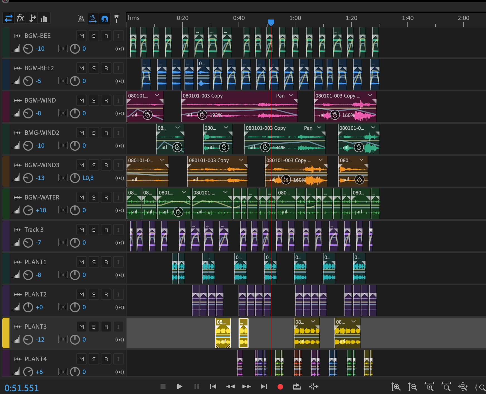

### Scene

The landscape of the garden was rearranged to the phase where the tree was in the center and all the plants were around them, and the users should walk around the tree to revive the plants. It is more logical in a way based on our storytelling that the goal of the game is to revive the honey tree. And it is more intereting than a simple linear path. Alhough it might be a bit difficult to lead the users to the right direction once entered the game. We haven't solved the problem yet.

### Errors

The more we work in Unity, the more bugs and mistakes coming along. like the floor texture doesnt work, which was a fundamental disaster of the project, and the material of tear got too glittering... We spent lots of time checking the problems and we solved them in this last day's challenge of will.

### Postprocessing

We checked the postprocessing tutorial and we created a hexagon web to imitate the bee's vision. It worked out well.

Elie corrected the colors of the game and the atmospheres got better.

### Sound

Huiwen edited the sound recorded and applied them in the game. But the result is a bit noisy and the buzz was overwhelming. So she edited the sound again with more interval bettween chapters and added more changes to the loop. Through several tests, she managed to create a balance of being noisy and harmonious. After several iterations the result got better.

### Antennas

We changed to a new antennas model which have more details. At the end of the day, we struggeled with the position of the antennas as sometimes we could see the end part of it which was not right.

### Hand Visulization

We only have a skeleton of hands in the game, the flesh was missing. Elie insisted to recover the mesh of hands and he figured it out at the end of the day. So far, our project was finished for this course.
